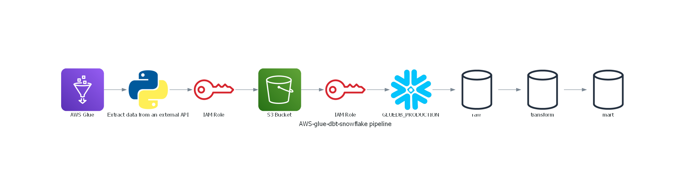
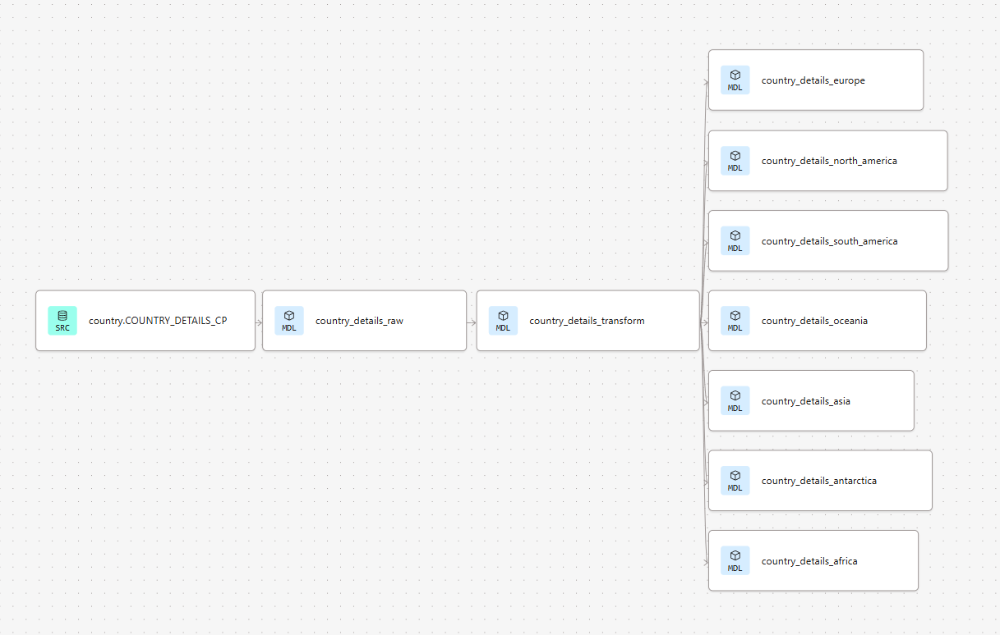

# 🧪 AWS Glue + dbt + Snowflake ELT Pipeline

This project demonstrates a batch data pipeline that extracts data from an external API using AWS Glue, lands it into S3, and then uses dbt to model and transform that data within Snowflake.

The focus is on modular ELT design, decoupling ingestion from transformation, and enabling reproducible analytics pipelines using version-controlled infrastructure and code.

---

## 🧩 Architecture Overview


## 🧩 DBT Lineage


---

### Components

1. **AWS Glue**: Extracts JSON data from an external API and writes it to S3.
2. **Amazon S3**: Acts as the data lake/layer for raw storage.
3. **Snowflake**: Hosts raw and transformed tables for analytics.
4. **dbt (Data Build Tool)**: Performs transformation logic using staged and mart models.
5. **macros, snapshots, and seeds**: Support versioned modeling and testing.

---

## 🔧 Tech Stack

- **AWS Glue** – Serverless ETL engine for Python-based ingestion
- **Amazon S3** – Raw data storage
- **Snowflake** – Cloud data warehouse for scalable analytics
- **dbt** – Transformation and modeling layer
- **Python** – Used in Glue jobs and dbt models
- **GitHub** – Source control for CI/CD and dbt versioning

---

## 📌 Project Steps

### 1. Create AWS IAM Role for Glue Job
- Permissions to read from and write to S3

### 2. Set Up S3 Bucket
- Used to store extracted JSON data

### 3. Create AWS Glue Job
- Python script to extract data from API
- Writes JSON files to S3 bucket

### 4. Set Up IAM Role and Storage Integration in Snowflake
- Allows Snowflake to read from S3
- Configure `STORAGE INTEGRATION` in Snowflake

### 5. Create DBT Cloud Account via Snowflake Partner Connect
- Enables integrated data modeling and transformation

### 6. Set Up DBT Models
- `raw/`: landing zone for S3-ingested data
- `transform/`: cleaned and enriched tables
- `mart/`: business-ready reporting layers

### 7. Set Up Deployment Environment in dbt
- Configure production jobs and environments
- Automate model runs and materializations

---

## 📂 Repository Structure
```
aws-glue-dbt-snowflake-pipeline/
│
├── README.md                  → Project overview and architecture details
├── .gitignore                 → Specifies intentionally untracked files to ignore
├── dbt_project.yml            → Configuration file for the dbt project
├── diagrams/
│   └── architecture.png       → Visual diagram of the AWS Glue + dbt + Snowflake pipeline
├── glue/
│   └── extract_api.py         → AWS Glue job script for extracting data from an external API
├── macros/
│   └── [macro_files].sql      → Custom dbt macros for reusable SQL snippets
├── models/
│   ├── raw/                   → dbt models for raw data staging
│   ├── transform/             → dbt models for data transformation
│   └── mart/                  → dbt models for data marts
├── seeds/
│   └── [seed_files].csv       → Seed data files for dbt
├── snapshots/
│   └── [snapshot_files].sql   → dbt snapshots for capturing slowly changing dimensions
├── snowflake/
│   └── snowpipe_trigger.sql   → SQL script to configure Snowpipe for auto-ingestion
├── src/
│   └── DiagramGenerator/
│       └── architecture.py    → Python script to generate architecture diagrams
└── tests/
    └── sample.json            → Sample JSON file used to test the API and Lambda function

---

---

## ✅ Highlights

- Modular pipeline separating ingestion (AWS) and modeling (dbt)
- Reusable macros and dbt configurations for fast onboarding
- Visualized architecture for communication and clarity

---

### Prerequisites

- Python 3.8+
- AWS Account with Glue and S3 permissions
- Snowflake account
- dbt CLI installed

---

## 🏷️ Tags & Topics
```
Use these hashtags when sharing the project:
#DataEngineering #AWS #Glue #S3 #Snowflake #dbt #ELT #Python #CloudAnalytics #OpenToWork

```


